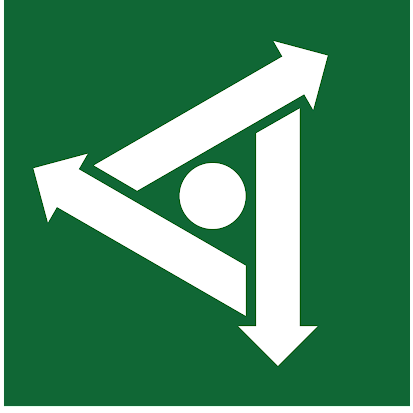

#  MolGeomAR

## An AR-powered accessible learning web app for molecular geometry 

[Insert description here]

# Tech

Forked from [https://bouncing.band](https://bouncing.band)

Uses [ThreeJS](https://threejs.org/)

Uses [WebXR device APIs](https://immersiveweb.dev/)


# Develop

```
yarn install && yarn start
```

Https is required by WebXR, you can use [ngrok](https://ngrok.com/) for https on local dev, there's a handy `yarn grok` command, if you have it installed.
